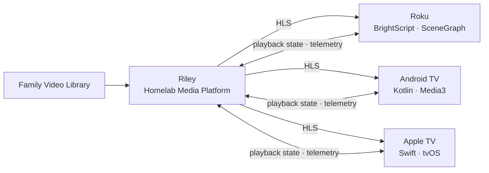

# Riley

Riley is a self-hosted media platform for streaming a family home-video library across Roku, Android TV, and Apple TV.

## Repositories

- [`riley`](https://github.com/marlware/riley) — backend media platform
- [`riley-roku`](https://github.com/marlware/riley-roku) — Roku client
- [`riley-android-tv`](https://github.com/marlware/riley-android-tv) — Android TV client
- [`riley-tvos`](https://github.com/marlware/riley-tvos) — Apple TV client

## Tech stack

- BrightScript + SceneGraph (Roku)
- Kotlin + Media3 (Android TV)
- Swift + tvOS (Apple TV)
- HLS (adaptive video streaming)
- Homelab server (self-hosted backend)

### System architecture

## Planned features

- HLS transcoding
- content discovery and browsing
- cross-device playback-state synchronization
- thumbnail generation pipeline
- quality-of-experience telemetry
- multi-device family video library
